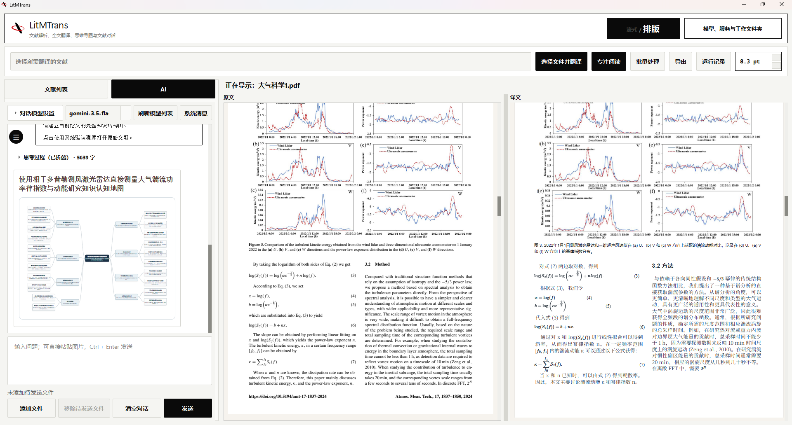
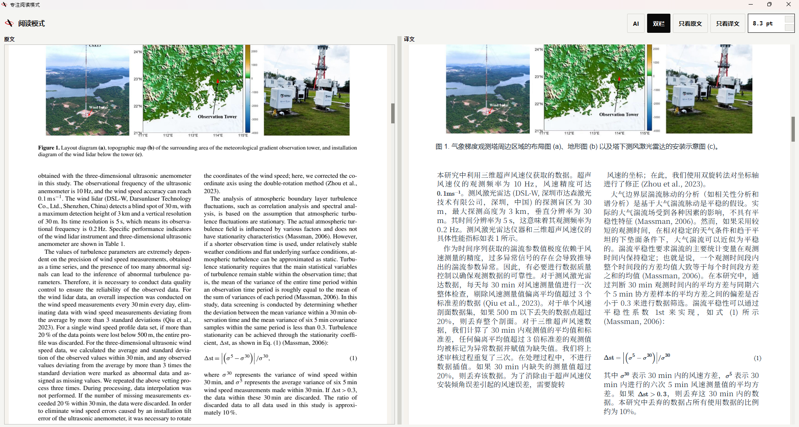
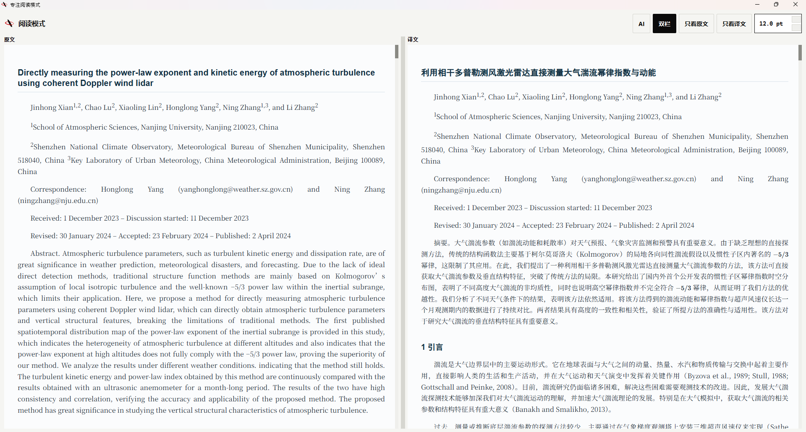
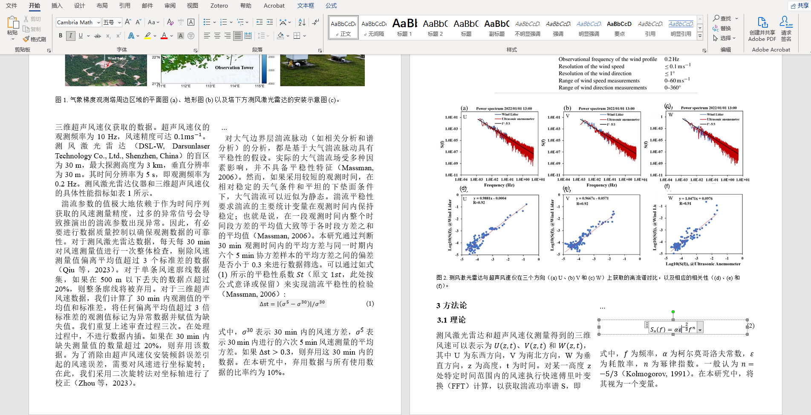
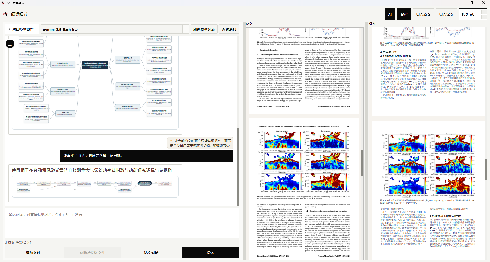
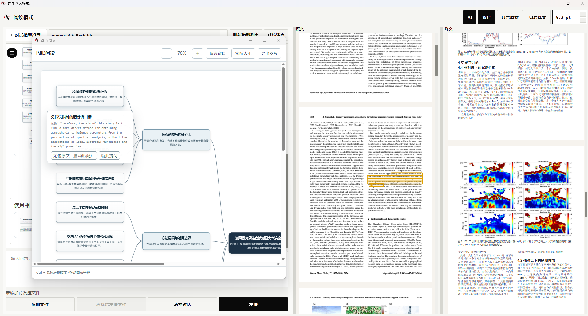

<p align="center">
  
</p>

<h1 align="center">LitMTrans</h1>

<p align="center">
  Windows桌面端的科研PDF解析、排版翻译、全文AI阅读与文档导出
</p>

<p align="center">
  <a href="https://github.com/SRT117/LitMTrans/releases/latest">下载发行版</a>
  · <a href="https://github.com/SRT117/LitMTrans-Zotero">Zotero 插件版</a>
  · <a href="#安装">安装</a>
  · <a href="#配置与成本">配置与成本</a>
  · <a href="#从源码运行与开发">从源码运行</a>
  · <a href="https://github.com/SRT117/LitMTrans/issues">问题反馈</a>
</p>

<p align="center">
  
  
  <a href="https://github.com/SRT117/LitMTrans/releases"></a>
  <a href="https://github.com/SRT117/LitMTrans/releases"></a>
  <a href="LICENSE"></a>
</p>

---

LitMTrans是一个Windows桌面文献处理程序，使用MinerU将PDF文献解析后用于翻译和AI对话（如果习惯在文献管理软件中使用，请参考配套的 [LitMTrans-Zotero](https://github.com/SRT117/LitMTrans-Zotero) 插件版本）。因为项目基于视觉解析的MinerU服务，所以对扫描版PDF文献也有较好的支持，可将期刊文献和学位论文PDF翻译为流式格式与排版格式，并支持导出可编辑的Word文档以及排版PDF。可以在程序中直接查看原文与译文、复制公式LaTeX、围绕整篇论文提问，也可以生成带原文证据的要点、思维导图和研究流程图。项目本身开源免费，MinerU Token需用户自行配置（官方提供免费日常额度），翻译服务可以选择免费翻译或者AI模型服务，其中AI模型服务需要自行配置API Key，程序支持多种模型服务商。



## 阅读与翻译

### 排版译文

排版模式按照MinerU识别出的栏目、图片、公式、标题和图注重新组织页面，程序依据内部规则进行排版迭代，尝试还原原文的版面结构。阅读时可以使用原文/译文双栏对照、单栏阅读、同步滚动、左右交换和字号调整。



### 流式译文

这种模式将多栏的文献还原为适合连续阅读的单一文本流，适合长篇学位论文和专著的连续通读。



### 公式与可编辑Word/PDF导出

识别出的数学公式会保留为LaTeX，可以在程序中点击公式单独查看并复制TeX。

在导出Word文档时，LitMTrans会将解析出的公式自动转换为Word原生的可编辑数学公式（OMML），便于在Word中直接修改公式、摘录文本或进行后续的写作与汇报。同时支持导出保留版式的PDF与Markdown文件。

需要注意的是，解析得到的公式可能存在识别误差，需要用户自行核对，不过一般情况下精度还是较高的。



### 模型翻译与参考文献

模型翻译可以设置目标语言和自定义翻译要求，也可以加入参考文献。参考文件经过文本读取或MinerU解析后，以完整文本作为术语、搭配、语体和领域表达的参考。

这在同一课题组、同一期刊或固定研究方向的连续翻译中比较实用：可以把已经认可的论文作为参考，让术语和表达习惯保持一致，同时仍逐篇忠实翻译当前文献。同样的道理，也可以把目标期刊的文献作为参考文献，将自己写作的论文翻译成目标语言，结合自定义翻译指令，以改善外文写作翻译效果。

如果不配置模型API，也可以把LitMTrans生成的结构化翻译指令复制到网页端AI，再将AI的回答粘贴回来完成排版渲染，算是一种另类的免费翻译方式，实测DeepSeek网页版可以直接一次性成功翻译整篇期刊文献。

除了大模型API外，Google/Bing网络翻译可以直接使用；Windows下还提供了Edge本地翻译，以及基于MTranServer的离线机翻选项。

## 全文AI阅读

AI阅读直接建立在MinerU的文档解析结果上，LitMTrans会把当前论文完整的解析Markdown和论文图片加入上下文，支持视觉输入的模型会按图片在正文中的出现顺序收到真实图片，后续问题继续沿用当前会话，也可以把选中的文字、公式或图片附加到问题中。

对话还可以额外加入PDF、Office文档、Markdown、文本或图片。文档类附件会先经过解析，再和当前论文一起作为上下文使用。

AI模块会将完整的文献上下文直接提供给AI，不做任何裁切或向量化切块，实测一篇五百多页的书籍占用大概230k token。AI对话模块默认不对历史消息进行切除，一方面保证了较高的缓存命中，另一方面不会因为连续对话导致初始对话被遗忘。不过这也导致对话上限受制于模型上下文限制，因此请自行把握上下文范围，避免超出模型能力。



### 要点、思维导图与研究流程

工具栏提供针对整篇论文的要点提炼、思维导图和研究流程三个入口。生成图示时，节点可以保存论文原文中的逐字证据，点击节点可以回到阅读器中对应位置核对上下文，思维导图节点还可以继续发起提问。在对话过程中提到“思维导图”、“流程图”等关键词，也可以触发AI绘制相应图形的能力。



研究流程图按照论文实际的研究问题、方法、证据、结果和条件关系组织，便于快速理清文献的研究思路。

### 大模型缓存命中

LitMTrans在请求结构中尽量保持全文和历史消息的前缀稳定，把每轮变化的选区和问题放在后部，并为会话维持稳定的缓存标识。支持返回缓存统计的服务会在界面显示输入、输出token和缓存命中率。对于NewAPI/OneAPI等服务，也进行了专门的缓存命中优化，相比市面上常见的AI聊天软件，LitMTrans的缓存命中率有较明显的提升。

这项处理也用于模型翻译，DeepSeek官方接口的快速排版翻译会先用少量请求确认长上下文缓存已经稳定，再释放后续并发。如果缓存没有达到保护条件，剩余批次不会继续发送，避免在长论文上重复产生未命中的全额输入费用。

## 适用的文献

### 常规电子论文、图片型PDF、扫描件与历史文献

扫描版、早期数字化文献和文字层损坏的PDF往往没有可靠的字符编码或阅读顺序，LitMTrans使用MinerU的识别结果进行翻译和排版，因此原文件不需要先具备可用的文字层，常规电子论文、图片型PDF、扫描件与历史文献都可以直接解析和翻译。

效果仍取决于扫描清晰度和MinerU的识别结果，模糊文字、复杂表格或公式识别错误会进入后续翻译和排版，使用时应以原文为准核对关键内容。

### 公式密集的论文

公式在解析后保留为可复制的TeX，并在译文中重新渲染，导出Word时转为原生公式。这样处理对公式较多的学科比较方便，也适用于原PDF公式字符无法直接读取的情况。公式字体和局部间距可能与原稿不同，识别正确性仍由MinerU的解析结果决定。

### 长PDF

当文件超过MinerU当前接口允许的单文件范围时，LitMTrans会在本地分段提交，再合并页码、图片和版面结果。这套流程已经在500余页的工程软件用户手册上完成过完整的解析、翻译和文档生成测试，这里的测试只说明目前处理过的文档规模，不代表固定的页数上限。另外，长文档建议使用分块翻译模式，避免因为上下文过长导致翻译模型后续智能水平持续降低引起翻译失真。

带权限加密且无法安全拆分的文件可能无法使用这一流程。MinerU的接口限制会随服务更新，具体以官方文档为准。

### EPUB电子书

支持直接在本地解析EPUB文件，提取书籍元数据、封面、目录树与各章节排版，支持双语排版对照阅读与EPUB导出。

---

## 安装

### GitHub Releases

从 [Releases](https://github.com/SRT117/LitMTrans/releases/latest) 下载最新的 Windows 安装包 `LitMTrans-<版本>-setup.exe`：

1. 双击安装程序，默认安装到当前用户目录（`%LOCALAPPDATA%\Programs\LitMTrans`），不要求管理员权限；
2. 启动后在初始设置窗口中选择工作文件夹，并填写MinerU Token（免费获取，请访问 [MinerU官网](https://mineru.net)）；
3. 如需使用AI翻译和AI对话，可填写对应的模型API Key；不填写AI的API Key也可以使用免费翻译服务进行翻译。

程序带有自动更新检查机制。启动后若检测到新版本，会先询问用户是否下载；下载完成后校验文件大小和 SHA-256，再由用户确认启动安装程序，不会静默安装。

未签名的 Windows 安装包可能触发 SmartScreen 提示，属于正常现象。

## 配置与成本

解析、翻译和AI阅读的服务可以分别配置。翻译模型和对话模型可以使用同一个服务，也可以各自选择不同模型。

| 模块 | 需要的凭证/服务 | 用途 |
| --- | --- | --- |
| 文献解析 | MinerU Token | 正文、公式、图片和版面结构提取 |
| 模型翻译 / AI阅读 | 第三方模型API Key | 全文翻译、问答、要点和图示生成 |
| Google/Bing翻译 | 无 | 免费网络机器翻译 |
| Edge本地翻译 | 无 | Windows本地翻译 |
| 本地机翻 (MTranServer) | 无 (需本地模型文件) | 本地离线神经网络机翻 |

LitMTrans本身以MIT License开源，没有订阅费用。MinerU官方API当前提供日常解析额度；额度和服务规则可能调整，请以 [MinerU官方文档](https://mineru.net/doc/docs/) 为准。

模型费用由所选服务商按实际token用量收取。以作者近期使用DeepSeek API的实际测试为例，一篇常见期刊论文的完整翻译约为 **¥0.07**。这个数字只用于说明当前使用量级，不是固定价格：论文长度、模型、输出量、缓存命中率和服务商定价都会影响最终费用。DeepSeek的当前价格见其 [官方定价页面](https://api-docs.deepseek.com/zh-cn/quick_start/pricing)。

如果只需要翻译而不使用模型能力，也可以选择Google/Bing，或在Windows下使用Edge本地翻译，使用手动翻译功能复制网页问答AI的结果也是非常不错的选择。

---

## 实现补充

### 文档解析如何进入AI上下文

当前论文解析完成后会生成结构化Markdown和图片资源。对话的第一轮把完整文档内容作为稳定的文档上下文加入会话；图片在支持视觉输入的模型上按照正文顺序发送，并与Markdown中的图片占位符、图注和上下文对应。模型不支持图片输入时，LitMTrans会保留全文文字并自动省略图片。

选区、用户当前问题和临时引用会追加在稳定的文档与历史消息之后。这种顺序同时服务于上下文缓存：对于按重复前缀计算缓存命中的服务，长论文正文可以在后续请求中保持较高的复用机会。会话还保存稳定的缓存键，并适配部分OpenAI兼容服务和OpenRouter的缓存/会话路由字段。

AI返回论文图片引用时，LitMTrans会检查来源标签和图片占位符，再解析到当前文档或附加文档中的本地图片。思维导图和研究流程中的证据则保存为原文逐字引用，用于后续定位和核对。

### 排版翻译如何重建页面

MinerU给出正文、标题、图片、公式、图注等元素及其页面位置。LitMTrans会把同一栏内连续的正文组织成可以重新换行的文本流，图片、公式和标题等继续作为独立视觉元素放在对应位置。浏览器完成实际渲染后，程序检查文字溢出和元素碰撞，再调整字号与行距。

生成页面保留的是栏目和主要视觉元素之间的关系。译文可以在栏内重新流动，因此跨语言文本长度变化不会被限制在原文的每一个小文本框里。

### 与pdf2zh / BabelDOC的实现差异

[PDFMathTranslate/pdf2zh](https://github.com/PDFMathTranslate/PDFMathTranslate) 和 [BabelDOC](https://github.com/funstory-ai/BabelDOC) 会直接利用PDF中已有的字符、字体、坐标和绘图对象，在PDF自身的版面信息上恢复段落、公式和样式，再完成译文排字和PDF生成。文字层完整、制作规范的电子PDF中，直接利用原始PDF对象通常更容易保留字体、公式外观和局部位置，pdf2zh等项目对此已经相当成熟。

LitMTrans的起点是MinerU输出的页面结构，译文随后在浏览器布局层重新组织，LitMTrans的正文换行空间更自由，规范的电子PDF、扫描件、文字层异常或字符编码损坏的文献都是同一套处理流程，LitMTrans对扫描件相比其他项目或许有更高的容忍度。不过LitMTrans的最终排版效果受MinerU解析结果的影响，对于不同的文献，可能出现部分字体大小不一的现象，这是因为部分正文被识别为图注等其他类型导致的。

公式也沿用这套结构化路线：MinerU输出的公式内容重新渲染并保留TeX。它不要求原PDF中的公式字符必须可读，但公式外观不追求逐像素复刻，识别错误也会反映在最终结果中。

这些差异主要来自两套方案对PDF信息的取用方式。对版式要求较高的文献，最终结果仍建议逐页核对。

---

## 数据与隐私

LitMTrans没有内置账号体系，也没有遥测和广告模块。程序设置和加密后的密钥保存在 `%APPDATA%\LitMTrans`。Windows版本使用当前Windows用户的 DPAPI 保护密钥；同一台电脑上的其他 Windows 用户不能直接解密。工作文件夹保存解析结果、译文、对话和导出文件。

使用外部服务时，需要注意对应的数据流向：

- MinerU解析会把待解析文档提交到用户配置的MinerU服务；
- 模型翻译会把需要翻译的文本，以及用户配置的参考语料发送到所选模型服务；
- 全文AI阅读会把解析后的论文正文发送给所选模型；启用视觉输入时还会发送论文图片；
- Google/Bing等网络翻译会把待翻译文本发送到对应服务。

文献包含敏感、保密或受限内容时，请在调用外部API前确认相应服务商的数据处理政策符合你的使用要求。详细说明见 [PRIVACY.md](PRIVACY.md)。

## 系统兼容性

- 支持 **Windows 10 / Windows 11 (64-bit)**；
- **Edge本地翻译**：受系统组件限制，仅支持Windows环境；
- 如需在 Zotero 文献管理软件中使用，可参考配套的插件项目 [LitMTrans-Zotero](https://github.com/SRT117/LitMTrans-Zotero)。

## 常见问题

### 没有模型API Key能否使用？

可以使用Google/Bing翻译，以及Windows下的Edge本地翻译。排版译文仍需要MinerU完成文档结构解析；模型翻译、全文问答、思维导图和研究流程等功能需要模型API。

### 扫描版PDF可以翻译吗？

可以。扫描件由MinerU完成识别，进入与普通PDF相同的翻译和排版流程，实际效果取决于扫描清晰度和解析结果。

### 导出的Word公式可以二次编辑吗？

可以。导出的Word文档中公式被转换为Word原生公式格式（OMML），双击即可直接编辑。

### AI会读取论文图片吗？

如果所选模型支持视觉输入，会。LitMTrans将论文图片按照它们在正文中的位置与文献全文一起加入上下文，非多模态模型会自动使用无图的全文上下文。

### AI回答中的图片来自哪里？

当模型按照文档中的图片引用返回图表时，LitMTrans会解析并显示MinerU提取的本地论文图片。它们来自当前论文或用户附加的文档。

### 公式可以复制吗？

可以。MinerU成功识别的公式可以直接复制为LaTeX，排版译文也使用这份公式内容重新渲染。

### 长PDF怎么处理？

超过MinerU当前单文件限制时，LitMTrans会自动拆分后分别解析，再合并页面和资源。实际测试过500余页的工程软件用户手册，并完成了后续翻译与文档生成。带权限加密且无法安全拆分的PDF可能无法使用这一流程。

### 缺少Pandoc或MTranServer会影响正常使用吗？

基础功能（PDF解析、在线翻译、Edge翻译、阅读、AI对话、HTML导出）不受影响。Pandoc主要用于Word导出深度排版与公式转换，若未放置且系统PATH中无Pandoc，程序在触发对应导出时会给出提示。

### 有 Zotero 插件版本吗？

有。如果您习惯在 Zotero 文献管理软件中直接阅读和管理文献，可以使用配套的 Zotero 插件版本：[LitMTrans-Zotero](https://github.com/SRT117/LitMTrans-Zotero)。插件支持在 Zotero 内直接查看排版译文、进行全文 AI 对话，并将生成的译文 PDF 自动挂载为条目附件。

---

## 从源码运行与开发

需要 Windows 和 Python 3.13。

```powershell
# 1. 克隆仓库并创建虚拟环境
git clone https://github.com/SRT117/LitMTrans.git
cd LitMTrans
py -3.13 -m venv .venv
.\.venv\Scripts\python.exe -m pip install --upgrade pip
.\.venv\Scripts\python.exe -m pip install -r requirements.txt

# 2. 运行应用程序
.\.venv\Scripts\python.exe litmtrans.py
```

### 运行测试

```powershell
$env:QT_QPA_PLATFORM = "offscreen"
.\.venv\Scripts\python.exe -m unittest discover -s tests -v
.\.venv\Scripts\python.exe scripts\validate_release.py
```

### 构建打包

打包与发布的详细说明见 [docs/RELEASING.md](docs/RELEASING.md)，可选组件配置说明见 [resources/README.md](resources/README.md)。

```powershell
# 构建 PyInstaller 目录
.\.venv\Scripts\python.exe scripts/build_release.py

# 使用 Inno Setup 编译生成安装包
& 'C:\Program Files (x86)\Inno Setup 6\ISCC.exe' "/DAppVersion=1.0.0" installer\LitMTrans.iss
```

---

## 致谢与相关项目

LitMTrans 的实现离不开以下开源项目与工具的启发和支持：

- [MinerU](https://github.com/opendatalab/MinerU)：高质量的文档视觉解析支持；
- [PDFMathTranslate / pdf2zh](https://github.com/PDFMathTranslate/PDFMathTranslate) 与 [BabelDOC](https://github.com/funstory-ai/BabelDOC)：学术文献双语排版翻译的先驱工作与思路启发；
- [Pandoc](https://github.com/jgm/pandoc)：文档格式转换与排版导出支持；
- [Bergamot Project / Firefox Translations](https://github.com/browsermt/bergamot-translator) 与 [Marian NMT](https://github.com/marian-nmt/marian-dev)：轻量级本地离线机器翻译运行时支持；
- [Adobe Source Han Serif](https://github.com/adobe-fonts/source-han-serif)：开源思源宋体字体。

## 报告问题与参与贡献

- Bug和功能建议：[GitHub Issues](https://github.com/SRT117/LitMTrans/issues)
- 开发贡献：[CONTRIBUTING.md](CONTRIBUTING.md)
- 版本记录：[CHANGELOG.md](CHANGELOG.md)
- 安全问题：请参考 [SECURITY.md](SECURITY.md)

### 开源信息

- 维护者：[SRT117](https://github.com/SRT117)
- 许可证：[MIT License](LICENSE)
- 第三方组件许可：[THIRD_PARTY_NOTICES.md](THIRD_PARTY_NOTICES.md)

*LitMTrans是独立开源项目，与Zotero、MinerU或相关模型提供商不存在隶属或合作关系。*
